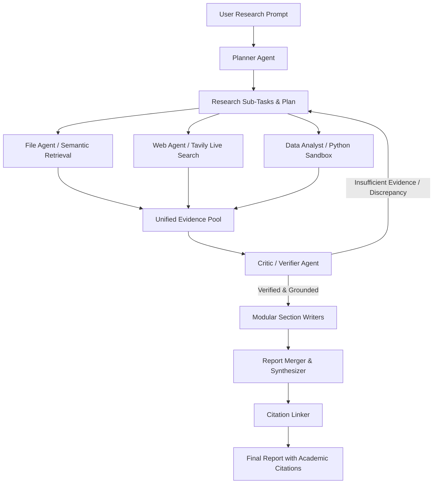

# AI Agentic Research Platform (v1)

A production-grade, multi-modal autonomous research platform powered by **Multi-Agent Collaboration** orchestrated with **LangGraph**, distributed storage in **PostgreSQL (pgvector)**, high-speed **Redis** caching & queueing, and real-time streaming interfaces via **FastAPI (REST & SSE)**.

---

## 1. System Architecture (App v1)

### 1.1 High-Level Architecture Diagram

```
                         ┌──────────────────────┐
                         │      Next.js /       │
                         │ React + TailwindCSS  │
                         └──────────┬───────────┘
                                    │
                               REST / SSE
                                    │
                                    ▼
                         ┌──────────────────────┐
                         │       FastAPI        │
                         │      API Layer       │
                         └──────────┬───────────┘
                                    │
         ┌──────────────────────────┼─────────────────────────┐
         │                          │                         │
         ▼                          ▼                         ▼
  ┌─────────────┐            ┌──────────────┐          ┌──────────────┐
  │ PostgreSQL  │            │    Redis     │          │ Object Store │
  │  +pgvector  │            │ Cache & Q    │          │ MinIO / S3   │
  │ users       │            │ Namespaced   │          │ Raw PDF      │
  │ projects    │            │ Versioned    │          │ Excel, CSV   │
  │ runs        │            │ Invalidation │          │ DOCX, PPTX   │
  │ reports     │            └──────────────┘          └──────────────┘
  │ embeddings  │                   │
  └─────────────┘                   ▼
                         ┌──────────────────────┐
                         │      LangGraph       │
                         │  Multi-Agent Runtime │
                         └──────────┬───────────┘
                                    │
             ┌──────────────────────┼─────────────────────┐
             │                      │                     │
             ▼                      ▼                     ▼
       ┌───────────┐         ┌─────────────┐       ┌─────────────┐
       │  Planner  │         │ File Agent  │       │  Web Agent  │
       └─────┬─────┘         └──────┬──────┘       └──────┬──────┘
             │                      │                     │
             │                      │                     ▼
             │                      │                  Tavily
             │                      │
             ▼                      ▼
       ┌───────────┐         ┌──────────────┐
       │ Data      │         │ Evidence /   │
       │ Analyst   │         │ Retriever    │
       └─────┬─────┘         └──────┬───────┘
             │                      │
             └──────────┬───────────┘
                        ▼
                 ┌───────────────┐
                 │    Critic     │
                 │  / Verifier   │
                 └───────┬───────┘
                         ▼
                 ┌───────────────┐
                 │ Report Writer │
                 │  (Modular)    │
                 └───────┬───────┘
                         ▼
                 Report Synthesizer & Citations
```

---

## 2. Core Architectural Abstractions

To ensure enterprise scalability and maintainability, the system establishes four non-negotiable architectural boundaries:

1. **Explicit Resource Ownership & Multi-Tenancy**:
   - Hierarchy: `User → Project (via project_members with roles) → Conversations / Files / Runs / Reports`.
   - The `project_members` model facilitates multi-tenant team collaboration with four granular roles: `owner`, `admin`, `member`, and `viewer`.
   - All child resources are strictly scoped to a tenant boundary (`project_id`).

2. **`Conversation ≠ LangGraph Thread`**:
   - `conversations` represents user-facing business chat history and dialogue records.
   - `langgraph_thread_id` is an external reference identifier. Internal LangGraph state checkpointing is isolated in an independent checkpointer store, preventing runtime state bloat inside relational business tables.

3. **`File ≠ File Chunk ≠ Evidence`**:
   - `files`: Manages object storage references, upload lifecycle metadata, checksums, and soft-delete states.
   - `file_chunks`: Text segments enriched with vector embeddings (`pgvector`) for semantic similarity retrieval.
   - `evidence`: A normalized, scored pool of verified claims extracted from both local documents and external live web sources (via Tavily), driving hallucination checks and academic citations.

4. **`Run ≠ Report`**:
   - `runs`: Asynchronous multi-agent execution jobs managed by a formal state machine (`queued`, `planning`, `researching`, `analyzing`, `writing`, `reviewing`, `completed`, `failed`, `cancelled`), supporting retry mechanisms and idempotency.
   - `reports`: Structured research deliverables composed of modular sections (`report_sections`) and academic citations (`citations`). Individual sections can be regenerated independently without executing the entire research pipeline from scratch.

---

## 3. Multi-Agent Workflow & Research Loop



- **Planner Agent**: Analyzes the research question, formulates targeted sub-queries, and breaks the investigation into executable tasks.
- **File Analyst Agent**: Executes metadata-filtered semantic vector searches across project documents (PDF, Excel, Word, CSV).
- **Web Researcher Agent**: Queries the Tavily Search & Extract API to retrieve reliable, high-relevance web sources.
- **Data Analyst Agent**: Executes deterministic Python code in an isolated environment for statistical calculations on spreadsheets rather than relying on LLM arithmetic approximations.
- **Critic / Verifier Agent**: Cross-checks factual claims against the `evidence` pool, enforces numerical consistency, and eliminates hallucinations.
- **Modular Report Writers & Citation Linker**: Drafts individual report sections in parallel and embeds verified citations (`[1]`, `[2]`) mapping directly to underlying evidence sources.

---

## 4. Technology Stack

| Layer | Technology | Purpose |
| :--- | :--- | :--- |
| **Backend Framework** | Python 3.12+, FastAPI, Pydantic v2 | High-performance asynchronous REST & SSE streaming APIs |
| **Database & ORM** | PostgreSQL 16+, SQLAlchemy 2.0 (Async), `asyncpg` | ACID-compliant async persistence, relationships, and transactions |
| **Vector Database** | `pgvector` (`VectorType` with dynamic dimension) | High-dimensional semantic similarity search (Cosine distance) |
| **Database Migrations**| Alembic (Async / Sync) | Schema lifecycle management with automated upgrade/downgrade testing |
| **Caching & Invalidation** | Redis, `redis.asyncio` (with `fakeredis` test harness) | Versioned namespaced caching, automated invalidation, rate limiting |
| **Agent Orchestration**| LangGraph, LangChain, LangSmith | State graphs, checkpointing, and multi-agent coordination |
| **Live Web Search** | Tavily Python SDK | Real-time news and scholarly document retrieval |
| **Document Processing**| PyMuPDF, python-docx, openpyxl, pandas | Native parsing for PDF, Word, Excel, and CSV documents |
| **Security & Auth** | `bcrypt`, PyJWT | Secure password hashing, OAuth2 JWTs with Refresh Token Rotation |
| **Testing Suite** | Pytest, `pytest-asyncio`, `aiosqlite`, Testcontainers | End-to-end async unit, integration, and migration test automation |

---

## 5. Completed Work & Deliverables (Stage 1 & Security Phase)

### 5.1 Database Schema & SQLAlchemy 2.0 Async Models (15 Tables)
Every model is built with UUID primary keys, soft-delete awareness (`deleted_at`), composite indexes, and typed columns (avoiding untyped JSONB for queryable fields):

1. **`users`**: Unique email, bcrypt password hash, active status, avatar, and `is_superuser` platform maintenance flag.
2. **`projects`**: Workspace container with name, description, timestamps, and soft-delete index.
3. **`project_members`**: Composite primary key `(project_id, user_id)` with role assignment (`owner`, `admin`, `member`, `viewer`).
4. **`conversations`**: Project-scoped conversation container with soft-delete and decoupled `langgraph_thread_id` reference.
5. **`messages`**: Dialogue history tracking `role` (`user`, `assistant`, `agent`, `tool`), model used, and token usage counts.
6. **`files`**: File metadata tracking upload status (`uploaded`, `processing`, `extracting`, `chunking`, `embedding`, `ready`, `failed`), storage keys, checksums (SHA-256), idempotency keys, and soft-delete.
7. **`file_chunks`**: Document text chunks with vector embeddings using a dynamic dimension configured via `settings.EMBEDDING_DIMENSION`, with a unique constraint on `(file_id, chunk_index)`.
8. **`runs`**: Execution state machine entity tracking `status`, `current_step`, `progress_pct`, `retry_count`, `max_retries`, unique `idempotency_key` per project, and `duration_ms`.
9. **`run_steps`**: Granular execution logs for each sub-agent step (agent name, status, input/output data, duration, errors).
10. **`run_events`**: Event stream logs for Server-Sent Events (SSE) and frontend real-time tracking (`agent_started`, `agent_progress`, `citation_found`, `report_chunk`).
11. **`audit_logs`**: System-wide audit trail recording `who → did what → when → resource → payload`.
12. **`evidence`**: Normalized claims pool from web or document sources with `relevance_score` and source attribution.
13. **`reports`**: Synthesized research reports with versioning and soft-delete capability.
14. **`report_sections`**: Modular sections (`section_key`, `section_order`, `status`) enabling independent section regeneration.
15. **`citations`**: Academic citation mappings connecting report section statements to verified evidence records.

### 5.2 Database Migrations (Alembic)
- Configured `backend/alembic.ini` and `backend/alembic/env.py` to seamlessly handle both async (`asyncpg`, `aiosqlite`) and synchronous database connections.
- Automatically initializes the PostgreSQL vector extension (`CREATE EXTENSION IF NOT EXISTS vector;`).
- Created initial migration revision `0001_initial_schema.py` covering all 15 tables, foreign key constraints with `CASCADE/SET NULL`, and composite indexes.
- Verified migration safety via automated test: `upgrade head` → inspect 15 tables → `downgrade base` → verify clean removal → `upgrade head` (100% pass).

### 5.3 Versioned Redis Caching & Invalidation
- Implemented `CacheService` in `backend/app/core/cache.py` with structured versioning and namespacing:
  - Key Scheme: `v1:{namespace}:{action}:{id_or_user}:{params_hash}`
  - Examples: `v1:projects:list:usr_123:1:20:h_a7b8c9d0`, `v1:reports:detail:rep_456`
- Targeted cache invalidation triggers on all write mutations (`invalidate_project`, `invalidate_conversation`, `invalidate_report`).
- Built-in graceful degradation ensures the application continues operating smoothly without fatal errors if Redis becomes temporarily unavailable.

### 5.4 Metadata-Filtered Vector Similarity Search
- `FileRepository.similarity_search` combines high-dimensional Cosine distance with multi-attribute filtering:
  - Strict tenant boundary isolation (`project_id`).
  - Document scoping (`file_ids`).
  - Document format filtering (`mime_types` - PDF, Excel, etc.).
  - Pagination filtering (`page_numbers`).
  - Minimum similarity thresholding (`min_score`).

### 5.5 Decoupled Service Layer & Ingestion Separation
- **HTTP-Agnostic Services**: Services interact strictly via Pydantic DTOs and raise domain exceptions (`EntityNotFoundError`, `PermissionDeniedError`, `IdempotencyConflictError`), remaining independent from FastAPI `Request/Response` objects.
- **Ingestion Decoupled from File Lifecycle**:
  - `FileService`: Manages file metadata, upload status, storage provider keys, and soft-delete operations.
  - `IngestionService`: Focuses exclusively on text extraction, chunking, embedding generation, and vector index persistence.
- **Idempotency Protection**: Enforces `idempotency_key` on critical endpoints (`POST /api/v1/files`, `POST /api/v1/runs`) to safeguard against duplicated actions caused by network retries.

### 5.6 Enterprise Security, Auth, RBAC & HTTPS
- **OAuth2 / JWT with Refresh Token Rotation (RTR)**:
  - Tracks a unique token identifier (`jti`) and `family_id` in Redis.
  - Generates a new access token and rotated refresh token on each refresh.
  - Detects replay attacks if an already-consumed refresh token is presented and **immediately revokes the entire token family**.
- **Strict Token Type Validation**:
  - Protected API routes strictly enforce `payload['type'] == 'access'`.
  - The refresh endpoint enforces `payload['type'] == 'refresh'`, preventing cross-token presentation vulnerabilities.
- **Bcrypt DoS Protection**:
  - Enforces a 72-byte ceiling on passwords across Pydantic schemas and bcrypt hashing to prevent CPU-exhaustion denial-of-service attacks.
- **Brute-Force Rate Limiting**:
  - Employs a Redis-backed sliding-window rate limiter on `/login`, `/register`, and `/refresh` against credential-stuffing attacks.
- **Role-Based Access Control (RBAC)**:
  - Four-tier hierarchy: `owner (40)` > `admin (30)` > `member (20)` > `viewer (10)` via `require_project_role`.
  - **Admin-on-Admin Guard**: Admins can only invite, modify, or remove users with strictly lower roles (`member`, `viewer`), preventing unauthorized privilege escalation.
  - **The Last Owner Problem**: Owners cannot abandon a project or delete their membership without transferring ownership via `POST /projects/{id}/transfer-ownership` or deleting the project.
  - **Superuser Bypass**: Global administrators (`is_superuser`) can perform maintenance and audits without polluting project member tables.
- **Context-Aware XSS & Anti-SQLi Protection**:
  - Plain metadata fields (names, titles): Aggressively stripped of dangerous HTML tags, `<script>`, and JavaScript event handlers via `sanitize_metadata_text`.
  - Rich content / Prompts / Agent outputs: Mathematical inequalities (`<`, `>`) and code snippets are preserved intact in the database, with responses delivered under `Content-Type: application/json; charset=utf-8`.
  - Parameter bounds: Strict `max_length` constraints on all string schemas to eliminate ReDoS risks.
- **HTTPS & Security Headers Middleware**:
  - Supports reverse proxy SSL termination (`X-Forwarded-Proto: https`), preventing infinite redirect loops behind load balancers.
  - Injects modern security headers: `X-Content-Type-Options: nosniff`, `X-Frame-Options: DENY`, modern `X-XSS-Protection: 0`, and `Strict-Transport-Security` (HSTS).
  - Context-aware Content-Security-Policy (CSP): Strict for API routes while providing controlled exemptions for `/docs` and `/redoc` so Swagger UI operates correctly.

### 5.7 Automated Test Suite (16/16 Passed - 100%)
- `test_alembic_upgrade_and_downgrade_cycle`: Verifies end-to-end migration integrity.
- `test_auth_api`: Verifies registration, login, token type validation, and RTR replay detection.
- `test_rbac`: Verifies role permissions, admin privilege escalation prevention, last-owner safeguards, and superuser access.
- `test_security_sanitization`: Verifies XSS sanitization, prompt preservation, reverse proxy HTTPS, and CSP policies.
- Model, repository, soft-delete, vector search filtering, and Redis caching tests.

---

## 6. Project Directory Structure

```
research-agent/
├── backend/
│   ├── alembic/
│   │   ├── versions/
│   │   │   └── 0001_initial_schema.py   # Initial migration with 15 tables + pgvector
│   │   ├── env.py                      # Async & sync Alembic configuration
│   │   └── script.py.mako
│   │
│   ├── app/
│   │   ├── core/
│   │   │   ├── config.py               # Pydantic BaseSettings configuration
│   │   │   ├── database.py             # Async engine & sessionmaker
│   │   │   ├── cache.py                # Namespaced Redis caching & invalidation
│   │   │   ├── security.py             # Bcrypt, JWT, and RTR family management
│   │   │   ├── sanitizer.py            # Context-aware XSS & SQLi sanitization
│   │   │   ├── rate_limiter.py         # Sliding window rate limiter
│   │   │   ├── middleware.py           # Security headers & HTTPS middleware
│   │   │   └── exceptions.py           # Pure domain business exceptions
│   │   │
│   │   ├── ingestion/                  # Multi-Modal Document Parsing & Embedding
│   │   │   ├── parsers.py              # PDF (PyMuPDF), DOCX (python-docx), Excel/CSV (pandas/openpyxl), TXT
│   │   │   ├── chunker.py              # Semantic chunker with sliding overlap & metadata preservation
│   │   │   └── embeddings.py           # Embedding engine (OpenAI or deterministic normalized L2 fallback)
│   │   │
│   │   ├── agents/                     # LangGraph Multi-Agent Orchestration
│   │   │   ├── __init__.py             # Main agents package exports
│   │   │   ├── state.py                # ResearchState TypedDict schema
│   │   │   ├── graph.py                # StateGraph assembly, checkpointer, and workflow execution
│   │   │   ├── nodes.py                # Aggregator re-exporting all agent nodes
│   │   │   └── agentic/                # Dedicated Agentic Nodes Directory
│   │   │       ├── __init__.py         # Sub-package exports
│   │   │       ├── planner.py          # Planner Agent node
│   │   │       ├── file_analyst.py     # File Analyst Agent node (pgvector retrieval)
│   │   │       ├── web_researcher.py   # Web Researcher Agent node (Tavily search)
│   │   │       ├── data_analyst.py     # Data Analyst Agent node (numerical computation)
│   │   │       ├── critic.py           # Critic / Verifier Agent node (hallucination checks)
│   │   │       └── report_writer.py    # Report Writer Agent node (modular sections & citations)
│   │   │
│   │   ├── models/                     # 15 SQLAlchemy 2.0 Async Models
│   │   │   ├── base.py                 # UUID, Timestamps, SoftDelete, VectorType
│   │   │   ├── user.py
│   │   │   ├── project.py              # Project & ProjectMember models
│   │   │   ├── conversation.py
│   │   │   ├── message.py
│   │   │   ├── file.py                 # File & FileChunk (pgvector)
│   │   │   ├── run.py                  # Run & RunStep models
│   │   │   ├── run_event.py
│   │   │   ├── evidence.py
│   │   │   ├── report.py               # Report, ReportSection, Citation models
│   │   │   └── audit.py                # AuditLog model
│   │   │
│   │   ├── schemas/                    # Pydantic v2 DTOs
│   │   │   ├── common.py               # PaginationParams, PaginatedResponse
│   │   │   ├── user.py, project.py, conversation.py, message.py
│   │   │   ├── file.py                 # File DTOs + VectorFilterDTO
│   │   │   ├── run.py, evidence.py, report.py, audit.py
│   │   │
│   │   ├── repositories/               # Data Access Layer
│   │   │   ├── base.py                 # Generic BaseRepository with soft-delete filter
│   │   │   ├── user_repository.py
│   │   │   ├── project_repository.py   # Multi-tenant workspace scoping
│   │   │   ├── file_repository.py      # Metadata-filtered similarity search
│   │   │   ├── run_repository.py       # State machine, idempotency, steps
│   │   │   ├── evidence_repository.py
│   │   │   └── report_repository.py    # Report sections & citations
│   │   │
│   │   ├── services/                   # Business Logic Layer (HTTP-Agnostic)
│   │   │   ├── auth_service.py         # Registration, login, RTR rotation
│   │   │   ├── project_service.py      # Workspaces, RBAC escalation guards, cache
│   │   │   ├── conversation_service.py
│   │   │   ├── file_service.py         # File metadata & lifecycle management
│   │   │   ├── ingestion_service.py    # Document chunking, embedding, vector store
│   │   │   ├── run_service.py          # State transitions, idempotency, event logging
│   │   │   ├── report_service.py       # Modular reports, citations
│   │   │   └── audit_service.py        # Action auditing
│   │   │
│   │   ├── api/                        # FastAPI REST API Layer
│   │   │   ├── deps.py                 # OAuth2 dependencies, RBAC checker
│   │   │   ├── auth.py                 # Auth router (/register, /login, /refresh, /me)
│   │   │   ├── projects.py             # Projects router with RBAC enforcement
│   │   │   ├── conversations.py        # Conversations & messages endpoints
│   │   │   ├── files.py                # File listing & multipart upload endpoint
│   │   │   ├── runs.py                 # Analysis runs & SSE stream endpoint
│   │   │   ├── reports.py              # Report synthesis, sections, citations
│   │   │   └── __init__.py
│   │   │
│   │   └── tests/                      # Automated Test Suite (21 Tests Passing 100%)
│   │       ├── conftest.py             # Async SQLite & Fakeredis test fixtures
│   │       ├── test_agent_graph.py     # LangGraph 6-agent loop execution
│   │       ├── test_alembic_migration.py
│   │       ├── test_auth_api.py        # RTR, replay detection, token validation
│   │       ├── test_conversations_api.py
│   │       ├── test_ingestion_parsers.py # Multi-modal parsing, chunking, pgvector
│   │       ├── test_models.py
│   │       ├── test_rbac.py            # RBAC matrix, admin escalation, last owner
│   │       ├── test_reports_and_upload_api.py # File upload, pipeline, reports
│   │       ├── test_repositories.py
│   │       ├── test_security_sanitization.py # XSS, HTTPS proxy, CSP
│   │       └── test_services_and_cache.py
│   │
│   ├── main.py                         # Application factory & middlewares
│   ├── alembic.ini
│   └── requirements.txt
│
├── frontend/                           # React + Vite + TypeScript Modern Web Client
│   ├── src/
│   │   ├── api/                        # Typed API clients (auth, client, conversations, files, projects, reports, runs)
│   │   ├── components/                 # ChatArea, Sidebar, Modals (Auth, Project, FileUpload)
│   │   ├── context/                    # AuthContext, UIContext
│   │   ├── hooks/                      # useProjects, useConversations, useRuns
│   │   ├── styles/                     # Modern glassmorphic theme (index.css)
│   │   └── types/                      # TypeScript domain definitions
│   ├── package.json
│   └── vite.config.ts
└── README.md
```

---

## 7. Setup & Execution Instructions

### 7.1 Backend Setup & Execution
```bash
# Navigate to backend directory
cd backend

# Install dependencies
pip install -r requirements.txt

# Run database migrations
alembic upgrade head

# Run full automated test suite (21/21 passed)
python3 -m pytest backend/app/tests -v

# Start FastAPI server with live reload
uvicorn main:app --host 0.0.0.0 --port 8000 --reload
```
Interactive API documentation is accessible at `http://localhost:8000/docs`.

### 7.2 Frontend Setup & Execution
```bash
# Navigate to frontend directory
cd frontend

# Install dependencies
npm install

# Build production bundle
npm run build

# Start development server
npm run dev -- --host 0.0.0.0 --port 3000
```
The modern Web UI is accessible at `http://localhost:3000`.

---

## 8. Status & Verification Summary

- **Multi-Modal Ingestion**: Built & verified for PDF, Word (.docx), Excel (.xlsx), CSV, and TXT.
- **Vector Search**: pgvector similarity retrieval with metadata-level tenant isolation.
- **LangGraph Multi-Agent Loop**: Full 6-agent workflow operational with memory checkpointing.
- **Analysis Runs & SSE**: Real-time event streaming with deterministic finite state machine.
- **Modular Reports**: Independent section regeneration with evidence citations.
- **Web Interface**: Modern ChatGPT/Gemini dark aesthetics with transparent RTR token refreshing and real file ingestion.
- **Automated Tests**: 21/21 test suites passing with 0 errors.
